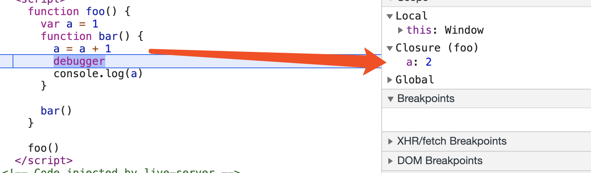
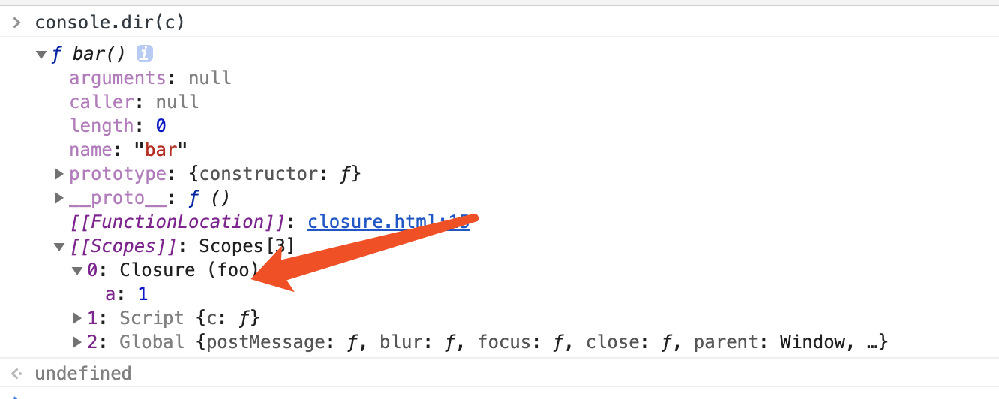
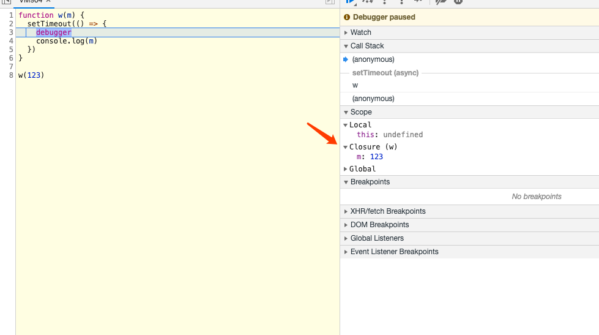
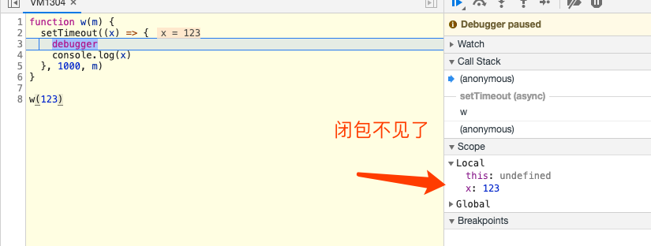

# 浅谈闭包

## 从一个demo开始观察闭包

看如下[代码](./closure.html)：
```
function foo() {
  var a = 1
  function bar() {
    a = a + 1 // 引用父级作用域中的a
    debugger  // 在这里打上断点方便在浏览器中查看闭包内容
    console.log(a)
  }

  bar()
}

foo()
```


在bar() 方法执行完之后，闭包就消失了

## 如何让它不消失

这里我们先分析为何闭包产生出来又消失了。在bar的作用域中，访问了其父级作用域foo的变量a，所以在bar内部形成了一个包含foo 的 a变量的作用域闭包，在浏览器上表现为 Closure(foo)

当bar方法执行结束后，上面的这个闭包就没有必要存在了，自然就释放了。这个过程可以在函数内部打个断点，在控制台上查看就会非常清楚。

那么，如果能够让bar方法执行结束后还保持对foo中a的访问，即可将闭包保存下来，这个意义就在于可以进行逆向的作用域访问。

```
function foo() {
  var a = 1
  var a2 = 2
  return function bar() { // 将bar返回，这样
    console.log(a) // 访问a，形成闭包
  } 
}    
let c = foo() // 实际上是c就是bar function
c() // 执行c方法，此时可以拿到a，完成作用域逆向访问操作
```

这样看可能还是会有些模糊，这个到底和闭包什么关系呢？闭包在哪里呢？
我们可以在控制台上使用 ```console.dir(c)```来用对象的形式打印c，如下图：


看，这就是bar保留的对foo作用域中的a的访问，也就是闭包

## 一个便于理解的定义

从上面的打印，我们可以将闭包理解为一个引用。当内部函数访问其外部函数作用域中的变量时，就会在内部函数中生成这样一个引用，内容就是访问的内容。

在最上面的那个例子中，因为foo执行完后 bar函数就被回收了，自然我们再也找不到这个闭包了
而在后面的例子中，将bar函数作用foo函数的返回，那么就可以在全局作用域中一直访问到bar，也就可以看到bar中对foo生成的闭包引用了

综上所述，闭包有两个关键点： 
1. 我们可以把闭包理解成一个引用
2. 当一个函数在其词法作用域内部访问了外部的函数词法作用域时，就会形成闭包。只要这个函数不被回收，这个闭包就一直在

## 闭包是帮我们解决问题的？

在之前的刚接触前端的时候，闭包是我不敢去触碰的东西。我搞不清楚这到底是个需要去预防的问题还是要去掌握的技能。而且总有一些奇怪的题容易产生误区：

```
for(var i = 0; i < 10; i++) {
  setTimeout(function() {
    console.log(i)
  })
} 

// 这里会打印10个 10

```
这是一个有闭包这个知识点就会经常伴随出现的问题，一度让我认为打印出来这10个10是因为闭包的缘故
其实这个题考察的是如何使用闭包来解决打印10个10的问题：

解决方案：

```
for(var i = 0; i < 10; i++ ) {
  (function(i) {
    // 我们可以理解在这个匿名函数的作用域中，分别被赋值 var i = 0 ~ 9
    setTimeout(function() {
      // 在setTimeout的function中都会有这样一个闭包  Closure: {i: 0 ~ 9} // i的值由上面的那个i值决定
      console.log(i) // 0,1,2,3,4,5,6,7,8,9 这样，打印出来的i值就是Closure中的i值，自然就是 0 ～ 9了
    })
  })(i);
}
```

这个题实际上是因为JS中 for语句无法产生块级作用域导致 i 被变量提升到了顶部，又因为JS的执行顺序，最后执行console.log(i) 时，i已经变成了10，自然打印出来的都是10，所以这个题用let来解决才是最好的解决方案:

```
for (let i = 0; i < 10; i++) {
  setTimeout(function() {
    console.log(i) // 0 ~ 9
  })
}
```

## 随处可见的闭包？

在开发中，闭包时常在代码中出现，我们却并未发现他。接下来我会分享几个常见的闭包场景，或许会更容易让你来看清闭包。

看如下代码：
```
function w(m) {
  setTimeout(() => {
    debugger
    console.log(m)
  }, 1000)
}

w(123)
```
在 1000ms 后，进入断点，此时我们可以看到，在1000ms w的内部作用域仍在被访问，且在setTimeout的匿名函数内存在一个闭包，如图所示：


看我来消除这个闭包
```
function w(m) {
  setTimeout((x) => {
    debugger
    console.log(x)
  }, 1000, m) // setTimeout在delay后传入的参数均可作为参数传递给function
}

w(123)
```

这样写后，m会被当作参数传入setTimeout，setTimeout内部的匿名函数不会再引用w内部变量，无法形成闭包。观察断点：


更贴合实际开发一些：

```
function getData(params) {

  let data = {
    // blabla
  }
  // 发送请求
  $.ajax({
    url: 'xxx',
    params,
    success(res) {
      if (data.xxx) { // success回调函数中引用getData的内部变量，产生闭包
        // ....
      }
    }
  })
}

getData(params)
```

以上这种场景比比皆是，每当我们使用回调函数，且在回调函数中使用了当前函数作用域的变量，就会在回调函数形成对当前函数作用域访问的闭包引用。

## IIFE与私有变量

以前有个小朋友叫王二狗，他不想让别人知道自己叫二狗，于是给自己起了个响亮的名字 王三炮
```
let person = {
  _name: '二狗',
  firstName: '王',
  name: '三炮',
  sayName() {
    return `${this.firstName}${this.name}`
  },
  // 二狗麻麻叫他
  motherCall() {
    return `${this.firstName}${this._name}`
  }
}
```
二狗自以为自己隐藏了二狗的名字，但是却不想我用console.log()一下子就看出来他叫二狗
二狗回去后苦修Javascript，终于找到了一种私有变量创建的方法:

```
let person =  (function() {
  const trueName = '二狗'
  return {      
    firstName: '王',
    name: '三炮',
    sayName() {
      return `${this.firstName}${this.name}`
    },
    // 二狗麻麻叫他
    motherCall() {
      return `${this.firstName}${trueName}`
    }
  }
})();

```
除了二狗麻麻，没有人知道他叫二狗了。这其实也是闭包的一种使用手法（可以在motherCall中打断点看到）

其实在我们现在经常写的模块语法和这个是有着异曲同工之妙的。我们可以在模块中定义变量并不暴漏出来，那模块文件中的内容就会被当作包含在作用域闭包中一样进行处理

## 如此好用的闭包？

还是从代码看起：

```
function getData() {
  let bigData = {
    // ...blabla
  }

  return function() {
    // 闭包
    let b = bigData
  }
}

let globalB = getData()
```
这里由于getData中返回的匿名函数一直保留对bigData的引用，造成了内存泄漏。而这是使用闭包最常见的问题之一

所以，当我们使用闭包的时候，更重要的是要知道为什么这样用，有没有会造成性能问题的可能